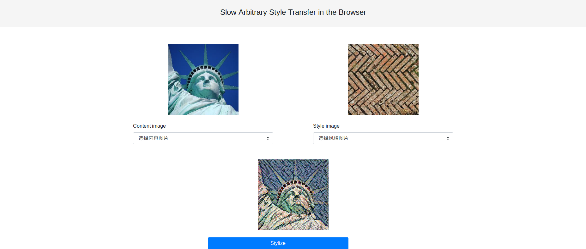
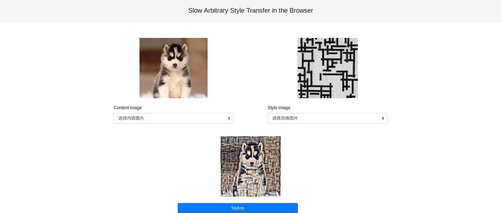

# 使用tensorflow.js进行在线风格迁移
* 需要提前安装好python3、tensorflow、keras、tensorflowjs、firefox浏览器
* 从[AaronJny](https://github.com/AaronJny/nerual_style_change)的tensorflow项目进行修改，为了尽可能减少计算资源消耗，删除了loss函数中关于内容损失的部分以及风格损失的后两次卷积损失计算
* 将VGG19模型改为VGG16模型，从keras.applications下载
* 设定图片尺寸为[224,224,3]、training step = 150 的前提下，浏览器将等待5~10分钟（太慢了，一方面硬件不行，另一方面感觉在浏览器下进行太深的学习不靠谱）
# 快速开始
* 执行start.sh
* 效果图：

# 改进空间
* 这应该是最早的风格迁移实现方法了吧，现在最新进展可以对一种风格进行训练，更厉害的有对任意风格特征的快速提取
* 附大佬们的实现：
[AaronJny](https://github.com/AaronJny/nerual_style_change)、
[reiinakano](https://github.com/reiinakano/arbitrary-image-stylization-tfjs)、
[hzy46](https://github.com/hzy46/fast-neural-style-tensorflow)
# 风格迁移相关论文：
* [Texture Synthesis Using Convolutional Neural Networks](https://arxiv.org/abs/1505.07376)
* [A Neural Algorithm of Artistic Style](https://arxiv.org/abs/1508.06576)
* [Perceptual Losses for Real-Time Style Transfer and Super-Resolution](https://arxiv.org/abs/1603.08155)
* [Exploring the structure of a real-time, arbitrary neural artistic stylization network](https://arxiv.org/abs/1705.06830)

